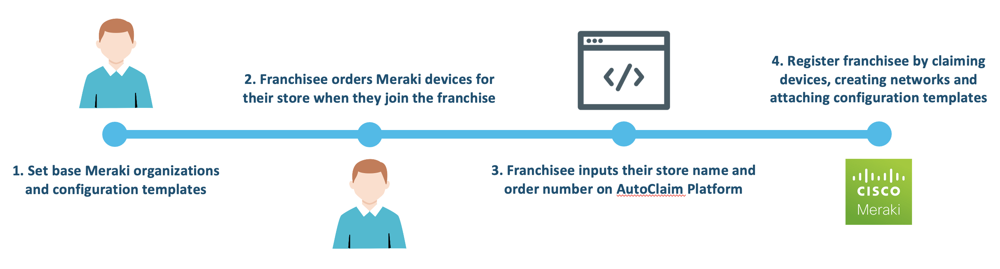
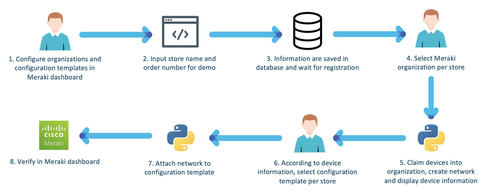

# Meraki AutoClaim Platform

Meraki AutoClaim Platform is a web-based dashboard that allows organizations easily onboard and manage Meraki multi-tenancy. It automates and simplifies device claim into organization and network, network creation, and configuration template attachment.

---

The following diagram describes the use case overview.



The following diagram describes the PoV high level design.




## Prerequisite
- **Meraki - Enable API Access** - enable API and get API key in Meraki Dashboard.
  1. Login to Meraki Dashboard.
  2. Go to "Organization" -> "Settings".
  3. Scroll down to the bottom and check "Enable access to the Cisco Meraki Dashboard API", then click "Save Changes".
  4. Click your email at the top right corner -> "My profile".
  5. Click "Generate new API key", copy your API key in the pop-up window, check the box and click "Done".
  6. Paste and keep the API key in a safe location.


## Installation

1. Clone this repository by `git clone <this repo>`.

2. Update the environment variables in ".env" file.

3. Optionally, create a Python 3 virtual environment.
```
python3 -m venv venv
source venv/bin/activate
```

4. Install the dependencies.
```
pip install -r requirement.txt
```

5. Run the Flask application.
```
export FLASK_APP=app.py
flask run
```

6. Access the dashboard at http://localhost:5000.
